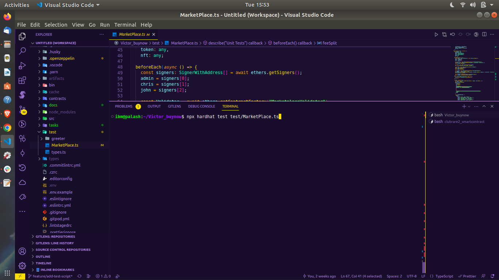
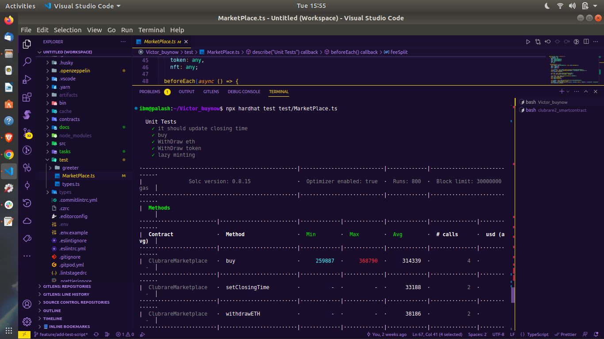

# Ethereum Deployment Steps:

### 1. Setup Environment

- Make sure `.env` is set for the `mainnet` or `goerli` deployment

- `yarn`

- `yarn clean`

- `yarn compile`

### 2. Deploy `Validator` contract

- Set `DEPLOY_NETWORK` to `goerli`or `mainnet`

- Run command ` npx hardhat run --network "network name" tasks/deploy/validator.ts`

- Run command `npx hardhat verify --network "network name" [proxy-address]`

### 3. Upgrade `Validator` contract

- Before Upgrading need to add proxy address in `VALIDATOR_PROXY` in`tasks/deploy/arguments/marketplace.ts`

- Run command ` npx hardhat run --network "network name" tasks/deploy/validatorUpgradable.ts`

- Run command `npx hardhat verify --network "network name" [proxy-address]`

### 4. Deploy `MarketPlace` contract

- Set `DEPLOY_NETWORK` to `goerli`or `mainnet`

- Add wallet address in `DEV_FUND_WALLET` in`tasks/deploy/arguments/marketplace.ts`;

- Run command ` npx hardhat run --network "network name" tasks/deploy/marketplace.ts`;

- Run command `npx hardhat verify --network "network name" [proxy-address]`

### 5. Upgrade `MarketPlace` contract

- Set `DEPLOY_NETWORK` to `goerli`or `mainnet`

- Before Upgrading need to add proxy address in `MARKETPLACE_PROXY` in`tasks/deploy/arguments/marketplace.ts`

- Run command ` npx hardhat run --network "network name" tasks/deploy/marketUpgradable.ts`

- Run command `npx hardhat verify --network "network name" [impl-address]`

### Testing `MarketPlace` contract

- Run command `npx hardhat test test/MarketPlace.ts`
  
- Test results
  
